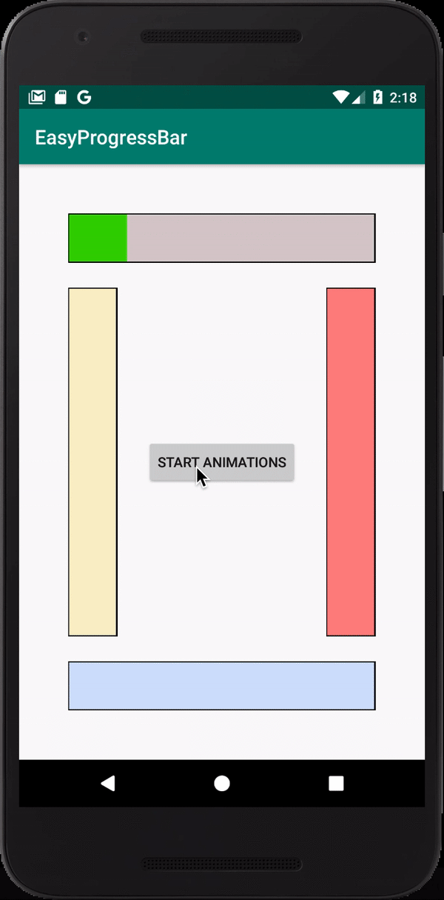

# EasyProgressBar
A simple nice **ProgressBar** which can be easily customized, and also be used.
Changable attributes are size (Width, Height), foreground (**Progress**) colour, background colour, border colour, and filling direction including up to down and down to up (Verical Filling) and (Horizontal Filling).
And also it can be filled during runtime like an animation with custom time and frames.
This is an example of the view:-



------------------------------------------

# Usage
You can easily add it to your projects by adding thins implementation to your Project's app gradle.build dependencies:-

```
dependencies {
  implementation 'com.example.easyprogressbar:easyprogressbar:0.1.0'
}
```

and using it in XML:-

```
<com.example.easyprogressbar.EasyProgressBar
        android:id="@+id/progressBar"
        android:layout_width="50dp"
        android:layout_height="match_parent"
        android:layout_marginLeft="50dp"
        android:layout_marginStart="50dp"
        android:layout_marginTop="250dp"
        android:layout_centerVertical="true"
        app:backColor="#2FFFC400"
        app:foreColor="#FABC00"
        app:value="10.0"
        app:maxValue="50.0"
        app:fillDirection="downToUp"/>
```
