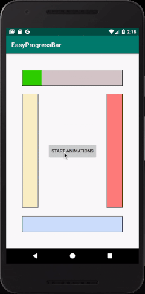

# EasyProgressBar
### A simple nice **ProgressBar** which can be easily customized, and also be used.

##### Changable attributes are size (Width, Height), foreground (**Progress**) colour, background colour, border colour, and filling direction including up to down and down to up (Verical Filling) and (Horizontal Filling).
##### And also it can be filled during runtime like an animation with custom time and frames.
----------
### This is an example of the view:-



------------------------------------------

# Usage
1. First add it to your project by adding this implementation to your Project's `app gradle.build` dependencies:-

```
dependencies {
  implementation 'com.example.easyprogressbar:easyprogressbar:0.1.0'
}
```

2. And add to your activity using one of the below described ways:-
   - Add the view into your layout XML file:-

   ```
   <com.example.easyprogressbar.EasyProgressBar
           android:id="@+id/progressBar"
           android:layout_width="50dp"
           android:layout_height="match_parent"
           android:layout_marginLeft="50dp"
           android:layout_marginStart="50dp"
           android:layout_marginTop="250dp"
           android:layout_centerVertical="true"
           app:backColor="#2FFFC400"
           app:foreColor="#FABC00"
           app:value="10.0"
           app:maxValue="50.0"
           app:fillDirection="downToUp"/>
   ```

   - Or Add it programmatically in the java code:-
   
   ```
   EasyProgressBar progressBar = new EasyProgressBar(this, Color.WHITE, Color.GREEN, EasyProgressBar.LEFT_TO_RIGHT);
   progressBar.setBorderColor(Color.WHITE);
   RelativeLayout parent = findViewById(R.id.parent);
   parent.addView(progressBar);

   RelativeLayout.LayoutParams layoutParams = (RelativeLayout.LayoutParams) progressBar.getLayoutParams();
   layoutParams.addRule(RelativeLayout.ALIGN_PARENT_BOTTOM);
   layoutParams.height = 10;
   layoutParams.width = RelativeLayout.LayoutParams.MATCH_PARENT;
   progressBar.setLayoutParams(layoutParams);
   ```
-------
# Attributes
- `backColor` : The color of the backgound(_unfilled_) area of the progress bar.
- `foreColor` : The color of the filled area of the progress bar.
- `border` : The color of the frame of the progress bar.
- `foreColor` : The color of the filled area of the progress bar.
- `fillDirection` : The direction of filling progress, options are (`leftToRight`, `rightToLeft`, `upToDown`, `downToUp`).
- `value` : Current progress value of the progress bar which measured per `maxValue`.
- `maxValue` : Max value of the progress bar.
--------
# Methods
there are setters and getters for every attribute, and also some other methods such as:-
- Constructor `public EasyProgressBar(Context context, int backColor, int foreColor, int fillDirection)` let you create the view programmatically with these parameters which described before.
- `void addValueAnimated(double valueToAdd_, final double seconds, final int frames)` : adds `valueToAdd_` to the progress bar or fill it like an animation per `maxValue`, the `seconds` parameter is the number of the seconds the animation spend to complete, and the `frames` parameter is the refresh rate of the animation per `seconds` parameter.
- `void addValueAnimated(double valueToAdd_, final double seconds, final int frames, final Runnable afterAdded)` : this method is exactly like the bove method instead of this is listenening to completion time and then run the `afterAdded` tasks after the animation completed.
----------
### Some Notes
- You can't animate a view when its currently animating.
- You can't use numbers below zero to the `value`, and also for the `maxValue`.
- `maxValue` should be bigger than zero.
- `maxValue`'s default value is `100`.
- you can set the `width` and the `height` of the view as you like.
-------
#### Created with :heart: by Azhy Slemany.
